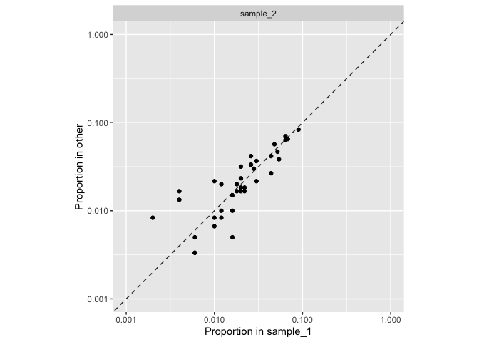

<!-- README.md is generated from README.Rmd. Please edit that file -->

# polyafit

<!-- badges: start -->
<!-- badges: end -->

`polyafit` is an R package that provides tools to fit count data to a
[Dirichlet-multinomial
distribution](https://en.wikipedia.org/wiki/Dirichlet-multinomial_distribution).

This distribution is sometimes called the multivariate Pólya
distribution, from which the package name is derived. The package was
created specifically for 16S rRNA marker gene sequence data from the
human microbiome, but in principle could be applied to other types of
data.

If you use this software in your research, please cite:

Charlson ES, Bittinger K, Chen J, Diamond JM, Li H, Collman RG, Bushman
FD. Assessing bacterial populations in the lung by replicate analysis of
samples from the upper and lower respiratory tracts. PLoS One.
2012;7(9):e42786. doi: 10.1371/journal.pone.0042786. Epub 2012 Sep 6.
PMID: 22970118; PMCID: PMC3435383.

## Installation

You can install polyafit from [GitHub](https://github.com/) with:

``` r
# install.packages("devtools")
devtools::install_github("kylebittinger/polyafit")
```

## Example

``` r
library(tidyverse)
```

We will use a built-in example dataset, `polyafit_example_data`, to
demonstrate how the package works. The example data is in the form of a
matrix, with three observations and 50 features. In this example, each
observation corresponds to a microbiome sample and each feature
corresponds to a bacterial species. The numbers in the matrix represent
the number of times each species was observed in the sample. Let’s print
out the example data to see how it looks.

``` r
polyafit_example_data
#>          species_1 species_2 species_3 species_4 species_5 species_6 species_7
#> sample_1         1        24        27         8        10        15        11
#> sample_2         5        34        23         9        14        13        10
#> sample_3         1        20        23       150        14        14        12
#>          species_8 species_9 species_10 species_11 species_12 species_13
#> sample_1         5         3          0          2          5          0
#> sample_2         5         0          4         10         13          2
#> sample_3         4         0          2          2          3          3
#>          species_14 species_15 species_16 species_17 species_18 species_19
#> sample_1         15          9         13         13         10         14
#> sample_2         22         10         25         20         10         18
#> sample_3         20         17         15          9          8         19
#>          species_20 species_21 species_22 species_23 species_24 species_25
#> sample_1         22          3          3          2          3          0
#> sample_2         16          3          0          8          2          3
#> sample_3         17          1          2          3          1          3
#>          species_26 species_27 species_28 species_29 species_30 species_31
#> sample_1         10          2         26         10          8          2
#> sample_2         11          2         28         19          3          1
#> sample_3         10          0         16         16          5          3
#>          species_32 species_33 species_34 species_35 species_36 species_37
#> sample_1          6          1         45          9          2          1
#> sample_2         12          0         50         12          1          0
#> sample_3         13          1         52         13          3          1
#>          species_38 species_39 species_40 species_41 species_42 species_43
#> sample_1         22         32          3          8          6          6
#> sample_2         25         38          2          6          6          5
#> sample_3         30         38          5          4          3          9
#>          species_44 species_45 species_46 species_47 species_48 species_49
#> sample_1          0         32         34         11          1          5
#> sample_2          3         42         39         11          1          4
#> sample_3          3         32         38         20          4          4
#>          species_50
#> sample_1          0
#> sample_2          0
#> sample_3          1
```

Looking down each column, we can see that the number of counts per
species is approximately the same for the three samples, except for
`species_4`. This species seems to be over-represented in `sample_3`
(150 counts) relative to the other samples (8 and 9 counts).

Our goals are to measure the overall correspondence in species
abundances between the samples, and then to use this as a yardstick to
determine if a species is over-represented in one of the samples.

### Analysis: no features enriched

To start, we will select the first two samples and run a fit. When the
example data set was generated, these samples were drawn from the same
multinomial distribution. Therefore, we should not detect any features
that are enriched in one sample relative to the other. Furthermore, we
expect to observe a high degree of correspondence between the relative
abundances, or in other words, a low degree of overdispersion relative
to the multinomial distribution.

We select the two samples by name, giving a matrix with two rows and 50
columns.

``` r
example12 <- polyafit_example_data[c("sample_1", "sample_2"),]
```

We find the best-fit parameters of the distribution using the `pfit()`
function.

``` r
fit12 <- example12 %>%
  pfit()
```

We can call `plot()` on this object to see a nice plot of the data.

``` r
fit12 %>%
  plot()
```



The `feature_enrichment()` function gives p-values and parameter
estimates for enrichment of each feature relative to the overall
distribution. For our first example, all p-values are greater than 0.05.

``` r
fit12 %>%
  feature_enrichment() %>%
  filter(p.value < 0.05)
#> # A tibble: 0 × 6
#> # … with 6 variables: observation <chr>, feature <chr>, counts <dbl>,
#> #   expected_counts <dbl>, sigma <dbl>, p.value <dbl>
```

The fitted object comes with an overdispersion parameter, theta. Theta
tells us how much “extra variance” the estimated distribution has,
beyond what we expect from a multinomial distribution. Because the data
here were generated directly from a multinomial distribution, the
estimated overdispersion parameter should be very small.

``` r
fit12$theta
#> [1] 7.575866e-07
```

### Analysis: one outlier

In sample 3, we’ve adjusted one of the species to increase the number of
counts. We should see this species, `species_4`, to be enriched in our
analysis.

``` r
example13 <- polyafit_example_data[c("sample_1", "sample_3"),]
```

We’ll go through the same sequence of steps to run the fit, plot the
data, and test for feature enrichment.

``` r
fit13 <- example13 %>%
  pfit()
```

``` r
fit13 %>%
  plot()
```


Here, we can see that the abundance of `species_4` is higher than
expected, based on the overall distribution.

``` r
fit13 %>%
  feature_enrichment() %>%
  filter(p.value < 0.05)
#> # A tibble: 1 × 6
#>   observation feature   counts expected_counts sigma       p.value
#>   <chr>       <chr>      <dbl>           <dbl> <dbl>         <dbl>
#> 1 sample_3    species_4    150            67.1  6.84 0.00000000863
```

Now, we re-calculate the overdispersion parameter, theta. It has
increased by four orders of magnitude.

``` r
fit13$theta
#> [1] 0.00216279
```
